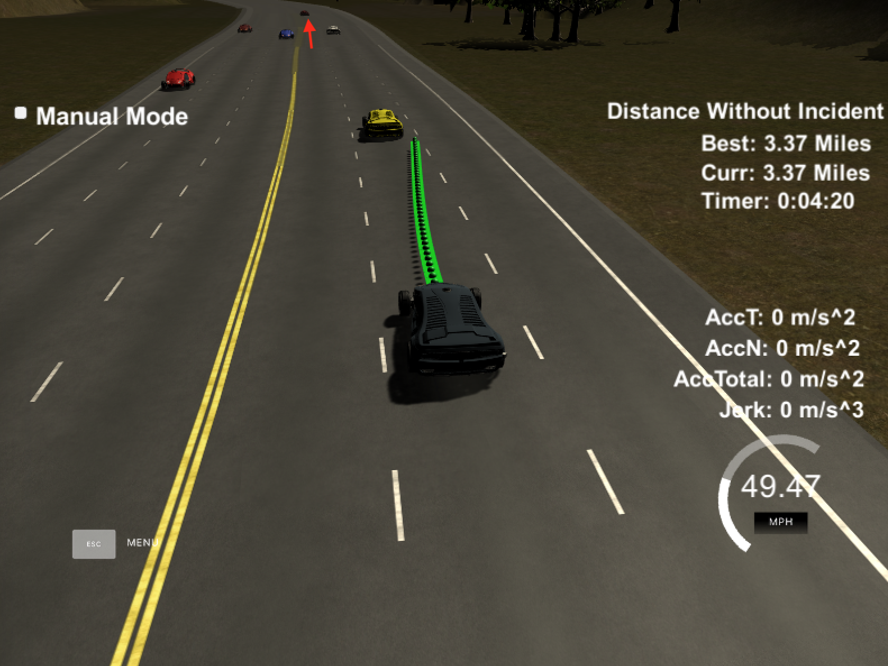

# Self-Driving Car Project 11. Path Planning

## Overview

In this project our goal is to safely navigate around a virtual highway with other traffic that is driving +-10 MPH of the 50 MPH speed limit. We will be provided the car's localization and sensor fusion data, there is also a sparse map list of waypoints around the highway. The car should try to go as close as possible to the 50 MPH speed limit, which means passing slower traffic when possible, note that other cars will try to change lanes too. The car should avoid hitting other cars at all cost as well as driving inside of the marked road lanes at all times, unless going from one lane to another. The car should be able to make one complete loop around the 6946m highway. Since the car is trying to go 50 MPH, it should take a little over 5 minutes to complete 1 loop. Also the car should not experience total acceleration over 10 m/s^2 and jerk that is greater than 10 m/s^3.

### Simulator
We can download the Car Simulator which contains the Path Planning project from the [releases tab (https://github.com/udacity/self-driving-car-sim/releases/tag/T3_v1.2).

### Map Data

The map of the highway is in data/highway_map.txt.

Each waypoint in the list contains [x,y,s,dx,dy] values. x and y are the waypoint's map coordinate position, the s value is the distance along the road to get to that waypoint in meters, the dx and dy values define the unit normal vector pointing outward of the highway loop.

The highway's waypoints loop around so the frenet s value, distance along the road, goes from 0 to 6945.554.

## Basic Build Instructions

1. Clone this repo
2. Make a build directory: `mkdir build && cd build`
3. Compile: `cmake .. && make`
4. Run: `./path_planning`

Here is an example of the output of the build:
```
$ cmake ..
-- The C compiler identification is AppleClang 9.1.0.9020039
-- The CXX compiler identification is AppleClang 9.1.0.9020039
-- Check for working C compiler: /Applications/Xcode.app/Contents/Developer/Toolchains/XcodeDefault.xctoolchain/usr/bin/cc
-- Check for working C compiler: /Applications/Xcode.app/Contents/Developer/Toolchains/XcodeDefault.xctoolchain/usr/bin/cc -- works
-- Detecting C compiler ABI info
-- Detecting C compiler ABI info - done
-- Detecting C compile features
-- Detecting C compile features - done
-- Check for working CXX compiler: /Applications/Xcode.app/Contents/Developer/Toolchains/XcodeDefault.xctoolchain/usr/bin/c++
-- Check for working CXX compiler: /Applications/Xcode.app/Contents/Developer/Toolchains/XcodeDefault.xctoolchain/usr/bin/c++ -- works
-- Detecting CXX compiler ABI info
-- Detecting CXX compiler ABI info - done
-- Detecting CXX compile features
-- Detecting CXX compile features - done
-- Configuring done
-- Generating done
-- Build files have been written to: /Users/informatics/Desktop/Tools/AI/CARND/Projects/Path-Planning/CarND-Path-Planning-Project/build

$ make
Scanning dependencies of target path_planning
[ 50%] Building CXX object CMakeFiles/path_planning.dir/src/main.cpp.o
[100%] Linking CXX executable path_planning
[100%] Built target path_planning

$ ./path_planning 
Listening to port 4567
Connected!!!
```

## Details

### Simulation Data

Here is the data provided from the Simulator to the C++ Program

#### Main car's localization Data (No Noise)

["x"] The car's x position in map coordinates

["y"] The car's y position in map coordinates

["s"] The car's s position in frenet coordinates

["d"] The car's d position in frenet coordinates

["yaw"] The car's yaw angle in the map

["speed"] The car's speed in MPH

#### Previous path data given to the Planner

Note: Return the previous list but with processed points removed, can be a nice tool to show how far along the path has processed since last time. 

["previous_path_x"] The previous list of x points previously given to the simulator

["previous_path_y"] The previous list of y points previously given to the simulator

#### Previous path's end s and d values 

["end_path_s"] The previous list's last point's frenet s value

["end_path_d"] The previous list's last point's frenet d value

#### Sensor Fusion Data, a list of all other car's attributes on the same side of the road (No Noise)

["sensor_fusion"] A 2d vector of cars and each car's unique ID, car's x position in map coordinates, car's y position in map coordinates, car's x velocity in m/s, car's y velocity in m/s, car's s position in frenet coordinates, car's d position in frenet coordinates

### Notes

1. The car uses a perfect controller and will visit every (x,y) point it recieves in the list every .02 seconds. The units for the (x,y) points are in meters and the spacing of the points determines the speed of the car. The vector going from a point to the next point in the list dictates the angle of the car. Acceleration both in the tangential and normal directions is measured along with the jerk, the rate of change of total Acceleration. The (x,y) point paths that the planner recieves should not have a total acceleration that goes over 10 m/s^2, also the jerk should not go over 50 m/s^3. (NOTE: As this is BETA, these requirements might change. Also currently jerk is over a .02 second interval, it would probably be better to average total acceleration over 1 second and measure jerk from that.)

2. There will be some latency between the simulator running and the path planner returning a path, with optimized code usually its not very long maybe just 1-3 time steps. During this delay the simulator will continue using points that it was last given, because of this its a good idea to store the last points you have used so you can have a smooth transition. previous_path_x, and previous_path_y can be helpful for this transition since they show the last points given to the simulator controller with the processed points already removed. We would either return a path that extends this previous path or make sure to create a new path that has a smooth transition with this last path.

### Tips

* A really helpful resource for doing this project and creating smooth trajectories was using http://kluge.in-chemnitz.de/opensource/spline/, the spline function is in a single hearder file is really easy to use.

## Dependencies

* cmake >= 3.5
  * All OSes: [click here for installation instructions](https://cmake.org/install/)
* make >= 4.1
  * Linux: make is installed by default on most Linux distros
  * Mac: [Install Xcode command line tools to get make](https://developer.apple.com/xcode/features/)
  * Windows: [Click here for installation instructions](http://gnuwin32.sourceforge.net/packages/make.htm)
* gcc/g++ >= 5.4
  * Linux: gcc/g++ is installed by default on most Linux distros
  * Mac: Same deal as make - [install Xcode command line tools]((https://developer.apple.com/xcode/features/)
  * Windows: Recommend using [MinGW](http://www.mingw.org/)
* [uWebSockets](https://github.com/uWebSockets/uWebSockets)
  * Run either `install-mac.sh` or `install-ubuntu.sh`
  * If you install from source, checkout to commit `e94b6e1`, i.e.
    ```
    git clone https://github.com/uWebSockets/uWebSockets 
    cd uWebSockets
    git checkout e94b6e1
    ```

## Editor Settings

We've purposefully kept editor configuration files out of this repo in order to
keep it as simple and environment agnostic as possible. However, we recommend
using the following settings:

* Indent using spaces
* Set tab width to 4 spaces (keeps the matrices in source code aligned)

## Code Style

Please (do your best to) stick to [Google's C++ style guide](https://google.github.io/styleguide/cppguide.html).

## Check Points

### The car is able to drive at least 4.32 miles without incident
The car was able to drive 4.5 miles without incident. The top right screen of the simulator shows the current/best miles driven without incident. Incidents include exceeding acceleration/jerk/speed, collision, and driving outside of the lanes. Each incident case is also listed below in more detail.


#### The car drives according to the speed limit
During the drive, the car didn't drive faster than the speed limit. Also the car wasn't driving much slower than speed limit unless obstructed by traffic.

#### Max Acceleration and Jerk are not Exceeded
During the drive, the car did not exceed a total acceleration of 10 m/s^2 and a jerk of 10 m/s^3.

#### Car does not have collisions
During the drive, the car did not come into contact with any of the other cars on the road.

For example, the car slowed down when it detected that there was another car ahead but there was no good condition to swith to another lane.


#### The car stays in its lane, except for the time between changing lanes
During the drive, the car stayed in its lane. The car didn't spend more than a 3 second length out side the lane lanes during changing lanes, and every other time the car stays inside one of the 3 lanes on the right hand side of the road.

#### The car is able to change lanes
During the drive, the car was able to smoothly change lanes when it made sense to do so, such as when behind a slower moving car and an adjacent lane is clear of other traffic.

For example, the car switched to the lane on its left when it detected that there was another car ahead and the lane on the left was free to swith to.


The car switched to the lane on its right when it detected that there was another car ahead and the lane on the right was free to swith to.


The car smartly swithed to the lane on its right when it detected that there was another car ahead and both the left and right lanes were free, but the right lane has a better condition because there was no car ahead. (Note: There is a car ahead in the left lane.)



## Reflection

Based on the provided code from the seed project, the path planning algorithms are implemented in function `AdjustCarSpeedAndLane` at [src/main.cpp#L252](https://github.com/wuzhanglin/CarND-Path-Planning-Project/blob/fa9d1179f9ca452cd2360c18bbe28ca893caa4c3/src/main.cpp#L252) and `GenerateCarControlPoints` at [src/main.cpp#L385](https://github.com/wuzhanglin/CarND-Path-Planning-Project/blob/fa9d1179f9ca452cd2360c18bbe28ca893caa4c3/src/main.cpp#L385).

### Prediction
`AdjustCarSpeedAndLane` at [./src/main.cpp#L252](https://github.com/wuzhanglin/CarND-Path-Planning-Project/blob/fa9d1179f9ca452cd2360c18bbe28ca893caa4c3/src/main.cpp#L252)

In this function (from [src/main.cpp#L272](https://github.com/wuzhanglin/CarND-Path-Planning-Project/blob/fa9d1179f9ca452cd2360c18bbe28ca893caa4c3/src/main.cpp#L272) to [#L341](https://github.com/wuzhanglin/CarND-Path-Planning-Project/blob/fa9d1179f9ca452cd2360c18bbe28ca893caa4c3/src/main.cpp#L341)) we use the telemetry and sensor fusion data to reason about the environment and to detect these three cases:

  - Whether there is a car in front of this car blocking the traffic
  - Whether there is a car on the left of this car making a lane change unsafe
  - Whether there is a car on the right of this car making a lane switching unsafe

These questions are answered by calculating the lane in which every other car is and the position it will be at the end of the last plan trajectory. A car is considered "dangerous" when its distance to our car is less than 25 meters in front or 15 meters behind this car.

### Behavior
`AdjustCarSpeedAndLane` at [src/main.cpp#L252](https://github.com/wuzhanglin/CarND-Path-Planning-Project/blob/fa9d1179f9ca452cd2360c18bbe28ca893caa4c3/src/main.cpp#L252)

In this function (from [src/main.cpp#L343](https://github.com/wuzhanglin/CarND-Path-Planning-Project/blob/fa9d1179f9ca452cd2360c18bbe28ca893caa4c3/src/main.cpp#L343) to [#L382](https://github.com/wuzhanglin/CarND-Path-Planning-Project/blob/fa9d1179f9ca452cd2360c18bbe28ca893caa4c3/src/main.cpp#L382)) we make a decision on what to do next if there is a car in front of this car:

  - Switch lanes?
  - Or, speed up?
  - Or, slow down?

Based on the prediction on the situation, this car increases the speed, decrease speed, or swithc the lane only when it is safe. To make the car speeding up or slowing down smoothly, we use a `car_info.speed_diff` for speed changes for generating the trajectory later:
```
// Line 21: Limit the acceleration so the car can speed up or slow down smoothly
constexpr const double kMaxAcc = 0.224;

// Line 373: Speed up the car smoothly if there is no car ahead of us
car_info.speed_diff -= kMaxAcc;

// Line 380: Or, slow down the car smoothly if there is a car ahead but we can't switch lanes
car_info.speed_diff -= kMaxAcc;

// Line 466: Finally, change the speed smoothly
car_info.ref_vel += car_info.speed_diff;
```

With this approach, we can make the car more responsive to situations where there is a car ahead which will possibly cause a collision, or there is no car ahead and we can speed up smoothly to the maximum speed allowed.

### Trajectory
`GenerateCarControlPoints` at [src/main.cpp#L385](https://github.com/wuzhanglin/CarND-Path-Planning-Project/blob/16b7df7625a407c2da68740dc6fab7e242c336cc/src/main.cpp#L385)

This function calculate the trajectory based on the speed and lane output from the behavior `AdjustCarSpeedAndLane` at [src/main.cpp#L252](https://github.com/wuzhanglin/CarND-Path-Planning-Project/blob/fa9d1179f9ca452cd2360c18bbe28ca893caa4c3/src/main.cpp#L252), car coordinates, and the previous path points.

We use the `spline` tool to generate the trajectory:

  # Step 1. Generate the first two positions using the last two points of the previous trajectory (from [src/main.cpp#L409](https://github.com/wuzhanglin/CarND-Path-Planning-Project/blob/fa9d1179f9ca452cd2360c18bbe28ca893caa4c3/src/main.cpp#L409) to [#L421](https://github.com/wuzhanglin/CarND-Path-Planning-Project/blob/fa9d1179f9ca452cd2360c18bbe28ca893caa4c3/src/main.cpp#L421)), or the car position if there are no previous trajectory (from [src/main.cpp#L397](https://github.com/wuzhanglin/CarND-Path-Planning-Project/blob/fa9d1179f9ca452cd2360c18bbe28ca893caa4c3/src/main.cpp#L397) to [#L405](https://github.com/wuzhanglin/CarND-Path-Planning-Project/blob/fa9d1179f9ca452cd2360c18bbe28ca893caa4c3/src/main.cpp#L405))

  # Step 2. Generate the next three positions using the three points at a far distance (from [src/main.cpp#L424](https://github.com/wuzhanglin/CarND-Path-Planning-Project/blob/fa9d1179f9ca452cd2360c18bbe28ca893caa4c3/src/main.cpp#L424) to [#L435](https://github.com/wuzhanglin/CarND-Path-Planning-Project/blob/fa9d1179f9ca452cd2360c18bbe28ca893caa4c3/src/main.cpp#L435))

  # Step 3. Transform (shift and rotation) the positions to local car coordinates to make the work less complicated to the spline calculation based on those points, and generate the spline using these points (from [src/main.cpp#L437](https://github.com/wuzhanglin/CarND-Path-Planning-Project/blob/fa9d1179f9ca452cd2360c18bbe28ca893caa4c3/src/main.cpp#L437) to [#L449](https://github.com/wuzhanglin/CarND-Path-Planning-Project/blob/fa9d1179f9ca452cd2360c18bbe28ca893caa4c3/src/main.cpp#L449))

  # Step 4. Copy the previous trajectory points into the current trajectory to smooth the trajectory (from [src/main.cpp#L451](https://github.com/wuzhanglin/CarND-Path-Planning-Project/blob/fa9d1179f9ca452cd2360c18bbe28ca893caa4c3/src/main.cpp#L451) to [#L456](https://github.com/wuzhanglin/CarND-Path-Planning-Project/blob/fa9d1179f9ca452cd2360c18bbe28ca893caa4c3/src/main.cpp#L456))

  # Step 5. Calculate the rest of the trajectory points by evaluating the spline and transforming the output coordinates to non-local coordinates (from [src/main.cpp#L458](https://github.com/wuzhanglin/CarND-Path-Planning-Project/blob/fa9d1179f9ca452cd2360c18bbe28ca893caa4c3/src/main.cpp#L458) to [#L493](https://github.com/wuzhanglin/CarND-Path-Planning-Project/blob/fa9d1179f9ca452cd2360c18bbe28ca893caa4c3/src/main.cpp#L493)). Note the change in the velocity of the car is decided by the behavior part, but is used to increase/decrease speed on each trajectory points instead of the whole trajectory (from [src/main.cpp#L466](https://github.com/wuzhanglin/CarND-Path-Planning-Project/blob/fa9d1179f9ca452cd2360c18bbe28ca893caa4c3/src/main.cpp#L466) to [#L474](https://github.com/wuzhanglin/CarND-Path-Planning-Project/blob/fa9d1179f9ca452cd2360c18bbe28ca893caa4c3/src/main.cpp#L474)).
